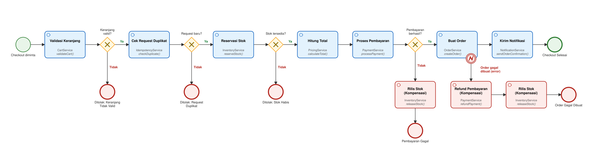

# Soal 2: BPMN Proses Checkout Marketplace dengan Kogito

Proses checkout marketplace dimodelkan sebagai BPMN 2.0 (`checkout.bpmn`) dan dieksekusi oleh Kogito di atas Quarkus. Saat build, Kogito membaca file BPMN ini lalu men-generate engine proses beserta REST endpoint-nya.

Stack: Java 17, Quarkus 3.15.3, Kogito / jBPM 10.1.0, H2 in-memory.

## Ilustrasi BPMN



File sumber: [`src/main/resources/com/example/checkout/checkout.bpmn`](src/main/resources/com/example/checkout/checkout.bpmn)

Proses memakai Start Event, Service Task, Exclusive Gateway (XOR), Boundary Error Event, dan End Event. Ada enam jalur:

| # | Jalur | Status akhir |
|---|---|---|
| 1 | Validasi ✔ → Request baru ✔ → Stok ✔ → Hitung Total → Bayar ✔ → Buat Order → Notifikasi | `COMPLETED` |
| 2 | Validasi ✘ | `REJECTED_INVALID_CART` |
| 3 | Validasi ✔ → Request baru ✘ | `REJECTED_DUPLICATE_REQUEST` |
| 4 | Validasi ✔ → Request baru ✔ → Stok ✘ | `REJECTED_OUT_OF_STOCK` |
| 5 | Validasi ✔ → Request baru ✔ → Stok ✔ → Hitung Total → Bayar ✘ → Rilis Stok | `PAYMENT_FAILED` |
| 6 | Validasi ✔ → Request baru ✔ → Stok ✔ → Hitung Total → Bayar ✔ → Buat Order ✘ (error) → Refund Pembayaran → Rilis Stok | `ORDER_FAILED` |

Di jalur 5, stok yang sudah di-reserve dikembalikan karena pembayaran gagal (kompensasi).

Di jalur 6, task "Buat Order" melempar exception setelah pembayaran berhasil. Boundary Error Event di task itu menangkapnya, lalu pembayaran di-refund dan stok dikembalikan, sehingga pembeli tidak membayar untuk order yang tidak pernah tercatat.

## Penjelasan service

Setiap Service Task di BPMN memanggil satu method di CDI bean Java. Data mengalir lewat satu process variable bernama `checkout` (class `Checkout`): tiap service menerimanya, mengisi bagiannya, lalu mengembalikannya. Gateway membaca flag yang diisi service untuk memilih cabang.

| Service Task | Class & method | Tanggung jawab | Flag untuk gateway |
|---|---|---|---|
| Validasi Keranjang | `CartService.validateCart` | `customerId` wajib ada, metode bayar wajib ada dan didukung, keranjang tidak kosong, SKU dikenal, qty 1–10 per SKU (baris dengan SKU yang sama dijumlahkan) | `cartValid` |
| Cek Request Duplikat | `IdempotencyService.checkDuplicate` | Mengklaim pasangan `customerId` + `requestId` di tabel `checkout_requests`. Request yang pasangannya sudah pernah diklaim ditolak, dan `orderNumber` dari order aslinya (kalau ada) ikut dikembalikan | `duplicateRequest` |
| Reservasi Stok | `InventoryService.reserveStock` | Mengunci stok semua item. Kalau satu item kurang, tidak ada stok yang dikurangi | `stockReserved` |
| Hitung Total | `PricingService.calculateTotal` | Harga dari katalog server. Ongkir Rp20.000, gratis bila subtotal ≥ Rp500.000. Voucher `HEMAT10` = 10%, maks Rp50.000 | – |
| Proses Pembayaran | `PaymentService.processPayment` | Simulasi payment gateway dengan limit per metode: BANK_TRANSFER 50 jt, CREDIT_CARD 25 jt, COD 5 jt, EWALLET 2 jt | `paymentSuccess` |
| Rilis Stok Kompensasi | `InventoryService.releaseStock` | Mengembalikan stok yang sudah di-reserve | – |
| Buat Order | `OrderService.createOrder` | Menyimpan order beserta item-itemnya (tabel `orders` dan `order_items`) ke H2 dan membuat nomor `ORD-yyyyMMdd-NNNN` dari sequence database `order_number_seq` | – (exception ditangkap Boundary Error Event) |
| Refund Pembayaran | `PaymentService.refundPayment` | Simulasi refund saat order gagal dibuat setelah pembayaran berhasil. Mengisi `paymentRefunded` dan status `ORDER_FAILED` | – |
| Kirim Notifikasi | `NotificationService.sendOrderConfirmation` | Konfirmasi ke pembeli (di sini berupa log) | – |

`ProductCatalog` menyimpan data produk dan stok di tabel `products` (H2). Data awalnya diisi saat aplikasi start:

| SKU | Produk | Harga | Stok |
|---|---|---|---|
| SKU-001 | Kaos Polos | 75.000 | 10 |
| SKU-002 | Celana Jeans | 250.000 | 5 |
| SKU-003 | Sepatu Sneakers | 650.000 | 3 |
| SKU-004 | Laptop Gaming | 15.000.000 | 2 |
| SKU-005 | Topi Bucket | 50.000 | 0 (habis) |

Contoh hubungan BPMN ke Java, dipotong dari `checkout.bpmn`:

```xml
<bpmn2:serviceTask id="Task_ReserveStock" name="Reservasi Stok"
    implementation="Java"
    drools:serviceinterface="com.example.checkout.service.InventoryService"
    drools:serviceoperation="reserveStock">
  ...
</bpmn2:serviceTask>

<bpmn2:sequenceFlow id="Flow_Stock_No" name="Tidak"
    sourceRef="Gateway_StockAvailable" targetRef="EndEvent_OutOfStock">
  <bpmn2:conditionExpression language="http://www.java.com/java">
    return !checkout.isStockReserved();
  </bpmn2:conditionExpression>
</bpmn2:sequenceFlow>
```

## Penjagaan race condition

Project ini dijalankan dan diuji sebagai **satu instance** aplikasi dengan H2 in-memory. Race condition yang dijaga adalah banyak request yang masuk bersamaan ke instance itu.

Penjagaannya diletakkan di database, bukan di memori JVM (`synchronized`, `AtomicInteger`).

| Risiko | Penjagaan |
|---|---|
| Stok terjual melebihi persediaan (oversell) | Reservasi memakai satu statement `UPDATE products SET stock = stock - :qty WHERE sku = :sku AND stock >= :qty`. Cek stok dan pengurangannya ada di statement yang sama, bukan baca-lalu-tulis dari Java. Kalau tidak ada baris yang ter-update, stok dianggap kurang. Dibuktikan oleh test konkurensi di `ProductCatalogTest` dan `CheckoutProcessTest` |
| Reservasi parsial untuk keranjang multi-SKU | Semua SKU di-update dalam satu transaksi. Satu SKU gagal, seluruhnya di-rollback |
| Deadlock antar-checkout | SKU selalu di-update dalam urutan yang sama (di-sort lewat `TreeMap`) |
| Request yang sama terkirim dua kali (klik ganda, retry) | Client mengirim `requestId`. Pasangan `customer_id` + `request_id` punya unique constraint, jadi dari beberapa request bersamaan hanya satu yang berhasil mengklaim; sisanya berakhir di `REJECTED_DUPLICATE_REQUEST` sebelum stok dan pembayaran tersentuh |
| Nomor order kembar | Nomor diambil dari sequence database, ditambah unique constraint di `order_number` |

### Transaksi

BPMN hanya mengatur alur. Akses database dilakukan method Java di balik tiap Service Task, masing-masing dalam transaksinya sendiri:

| Class | Method | Transaksi |
|---|---|---|
| `IdempotencyService` | `checkDuplicate` | Transaksi baru lewat `QuarkusTransaction.requiringNew()`, supaya error unique constraint bisa ditangkap setelah rollback |
| `ProductCatalog` | `tryReserve`, `release` | `@Transactional(REQUIRES_NEW)` |
| `ProductCatalog` | `find`, `all`, `stockOf` | `@Transactional` |
| `OrderService` | `createOrder` | `@Transactional(REQUIRES_NEW)` |

Endpoint `POST /checkout` yang di-generate Kogito ber-`@Transactional`, jadi lewat REST seluruh proses berjalan di dalam satu transaksi luar. Semua langkah yang menulis ke database memakai transaksi baru (`REQUIRES_NEW`) dan langsung commit, terlepas dari transaksi luar itu; hanya pembacaan katalog yang ikut transaksi luar. Dengan begitu exception di "Buat Order" hanya me-rollback transaksi order itu sendiri, dan jalur kompensasi tetap bisa berjalan sampai selesai. Reservasi stok dan klaim `requestId` harus segera terlihat oleh request lain, dan stok tidak boleh terkunci selama pembayaran berjalan. Karena itu stok tidak bisa di-rollback otomatis saat pembayaran gagal, dan dikembalikan secara eksplisit oleh task "Rilis Stok Kompensasi".

### Batasan

- Hanya dijalankan dan diuji sebagai satu instance.
- `requestId` opsional. Request tanpa `requestId` tidak dicek duplikatnya.
- `requestId` terpakai begitu lolos validasi keranjang, apa pun hasil akhirnya. Untuk mencoba lagi setelah stok habis atau pembayaran gagal, kirim `requestId` baru. `requestId` dari request yang ditolak di validasi keranjang masih bisa dipakai lagi.
- Request duplikat tetap berstatus `REJECTED_DUPLICATE_REQUEST`; hasil request aslinya tidak diputar ulang. Yang dikembalikan hanya `orderNumber` kalau order aslinya sudah tersimpan.
- Hanya kegagalan "Buat Order" yang punya jalur kompensasi di BPMN.
- Data H2 in-memory hilang setiap kali aplikasi berhenti: stok kembali ke data awal dan nomor order mulai lagi dari `0001`.

## Cara menjalankan

Prasyarat: JDK 17 dan Maven 3.9. Tidak perlu Podman: Kogito Dev Services dimatikan lewat `quarkus.kogito.devservices.enabled=false`, jadi dev mode tidak menyalakan container.

```bash
mvn quarkus:dev        # http://localhost:8081
```

Endpoint `/checkout` di-generate Kogito dari ID proses, sedangkan `/products` dan `/orders` ditulis manual di `StoreResource`. Kogito juga men-generate endpoint lain di bawah `/checkout` (instance dan task); daftar lengkapnya ada di Swagger UI. Yang dipakai di sini hanya `POST /checkout`.

| Method | Path | Fungsi |
|---|---|---|
| POST | `/checkout` | Memulai proses checkout |
| GET | `/products` | Katalog dan stok |
| GET | `/orders`, `/orders/{orderNumber}` | Order yang tersimpan di H2 |

Semua Service Task berjalan sinkron, jadi respons `POST /checkout` sudah berisi hasil akhir. Status HTTP-nya `201` untuk semua status akhir checkout; berhasil atau tidaknya dibaca dari `checkout.status`.

```bash
curl -s -X POST localhost:8081/checkout -H 'Content-Type: application/json' -d '{
  "checkout": {
    "requestId": "REQ-0001",
    "customerId": "CUST-01",
    "customerEmail": "budi@example.com",
    "paymentMethod": "BANK_TRANSFER",
    "voucherCode": "HEMAT10",
    "items": [ {"sku": "SKU-001", "quantity": 2}, {"sku": "SKU-002", "quantity": 1} ]
  }
}'
```

Respons (dipotong):

```json
{
  "id": "6f1c...",
  "checkout": {
    "status": "COMPLETED",
    "subtotal": 400000, "shippingFee": 20000, "discount": 40000, "total": 380000,
    "paymentReference": "PAY-1A2B3C4D",
    "orderNumber": "ORD-20261006-0001"
  }
}
```

Mencoba jalur gagal:

- Keranjang kosong: `"items": []` → `REJECTED_INVALID_CART`
- Metode bayar tidak didukung: `"paymentMethod": "CRYPTO"` → `REJECTED_INVALID_CART`
- Request duplikat: kirim ulang body yang sama dengan `requestId` yang sama → `REJECTED_DUPLICATE_REQUEST`, dengan `orderNumber` order aslinya
- Stok habis: `SKU-005` → `REJECTED_OUT_OF_STOCK`
- Pembayaran gagal: `SKU-004` dengan `"paymentMethod": "EWALLET"` → `PAYMENT_FAILED`, stok laptop kembali ke 2
- Order gagal dibuat (`ORDER_FAILED`): tidak bisa dipicu lewat request biasa. Jalur ini diuji di `CheckoutProcessTest` dan `CheckoutRestTest` dengan `OrderService` yang di-mock supaya melempar exception.

Swagger UI: http://localhost:8081/q/swagger-ui

`checkout.bpmn` bisa dibuka dengan KIE BPMN Editor; sudah dicoba dengan editor standalone `@kie-tools/kie-editors-standalone` 10.1.0.

## Testing

```bash
mvn test
```

Ada dua jenis test, keduanya tanpa container.

**Unit test service (Mockito).** Tiap service diuji sendiri, dengan `ProductCatalog` di-mock. `IdempotencyService`, `OrderService`, dan `NotificationService` tidak punya unit test sendiri; ketiganya dijalankan lewat test `@QuarkusTest` di bawah.

| Test | Yang di-mock | Yang diuji |
|---|---|---|
| `CartServiceTest` | `ProductCatalog` | Keranjang valid, keranjang kosong, SKU tidak dikenal, metode bayar tidak didukung, qty di atas batas (per baris dan per SKU) |
| `InventoryServiceTest` | `ProductCatalog` | Reservasi sukses dan gagal, rilis stok hanya bila sudah di-reserve |
| `PricingServiceTest` | `ProductCatalog` | Ongkir, gratis ongkir, diskon voucher dan batas maksimalnya |
| `PaymentServiceTest` | – (tanpa dependency) | Pembayaran dalam limit, melebihi limit, metode tidak didukung, refund |

**Test dengan Quarkus + H2 (`@QuarkusTest`).** Menjalankan `checkout.bpmn` dan database sungguhan untuk memastikan gateway mengarahkan tiap jalur ke End Event yang benar, dan penjagaan race condition bekerja saat diserbu banyak thread.

| Test | Skenario | Yang dicek |
|---|---|---|
| `CheckoutProcessTest` | Jalur sukses | Status `COMPLETED`, perhitungan total, stok berkurang, order tersimpan |
| | Sukses + voucher + gratis ongkir | Diskon maks Rp50.000, ongkir 0 |
| | Keranjang kosong / SKU tidak dikenal | Berakhir di keranjang tidak valid, stok tidak tersentuh |
| | Stok habis | Berakhir di stok habis, tidak ada reservasi parsial |
| | Metode bayar tidak didukung | Ditolak di validasi keranjang, stok tidak tersentuh |
| | Pembayaran gagal | Stok dikembalikan, tidak ada order |
| | "Buat Order" melempar exception (`OrderService` di-mock) | Status `ORDER_FAILED`, pembayaran di-refund, stok dikembalikan, tidak ada order |
| | Order tersimpan | Item order (SKU, nama, qty, total baris) ikut tersimpan |
| | 20 checkout bersamaan untuk stok 2 | Tepat 2 `COMPLETED`, 18 `REJECTED_OUT_OF_STOCK`, stok 0, 2 order dengan nomor berbeda |
| | `requestId` sama dikirim dua kali | Yang kedua `REJECTED_DUPLICATE_REQUEST` dengan `orderNumber` order pertama, stok hanya berkurang sekali, 1 order |
| | `requestId` berbeda | Keduanya diproses, 2 order |
| | `requestId` sama dari dua customer berbeda | Keduanya diproses, 2 order |
| | 20 request bersamaan dengan `requestId` sama | Tepat 1 `COMPLETED`, 19 `REJECTED_DUPLICATE_REQUEST`, 1 order |
| `ProductCatalogTest` | Reservasi dua SKU, salah satunya habis | Reservasi gagal, stok SKU lain tidak terpotong |
| | Reserve lalu release | Stok kembali ke nilai awal |
| | 32 thread reservasi SKU yang sama | Yang lolos tepat sebanyak stok, stok akhir 0 |
| | 32 thread reservasi dua SKU sekaligus | All-or-nothing: tidak ada stok yang terpotong sebagian |
| | 32 thread reserve lalu release berulang | Stok kembali ke nilai awal |
| `CheckoutRestTest` | `POST /checkout` | Respons JSON, order beserta itemnya bisa diambil lewat `/orders` |
| | `POST /checkout` dengan stok habis | Status `REJECTED_OUT_OF_STOCK`, tidak ada order |
| | `POST /checkout` saat "Buat Order" gagal | Respons tetap berhasil dengan status `ORDER_FAILED`, stok kembali, tidak ada order |
| | `POST /checkout` dua kali dengan `requestId` sama | Yang kedua `REJECTED_DUPLICATE_REQUEST` dengan `orderNumber` order pertama, hanya 1 order |
| | `GET /products` | Katalog berisi 5 produk |

## Struktur kode

```
src/main/resources/com/example/checkout/checkout.bpmn   # diagram + definisi proses
src/main/resources/import.sql                           # sequence nomor order
src/main/java/com/example/checkout
├── model/          # Checkout, CartItem, CheckoutStatus
├── service/        # implementasi tiap Service Task
├── entity/         # OrderEntity, OrderItem, ProductEntity, CheckoutRequestEntity
├── repository/     # OrderRepository, ProductRepository, CheckoutRequestRepository
└── controller/     # StoreResource: /products, /orders
docs/               # ilustrasi diagram (png/svg)
```
